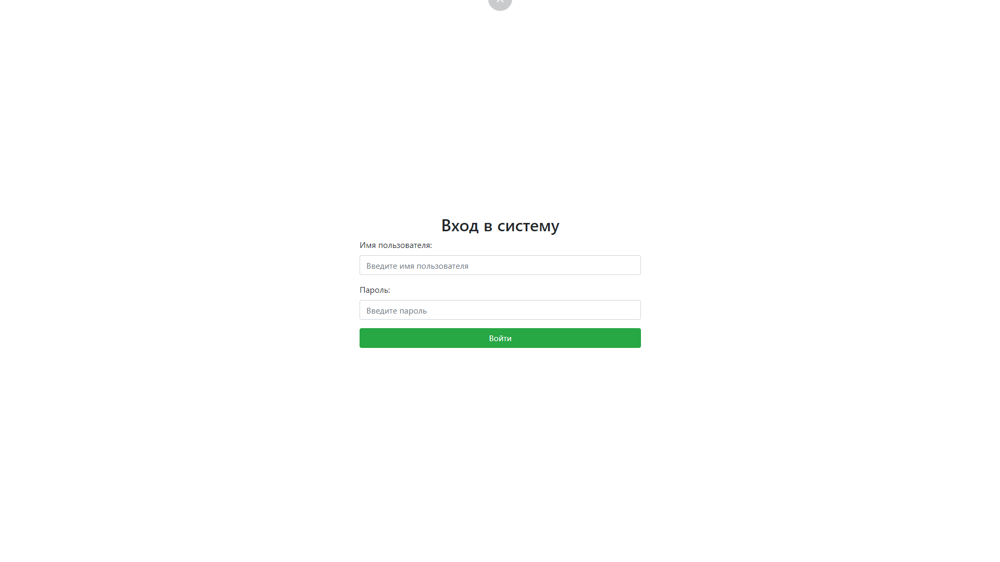
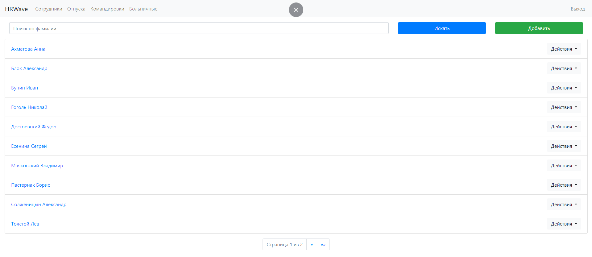
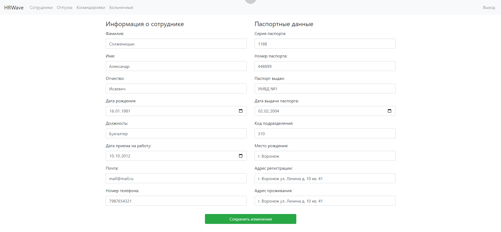
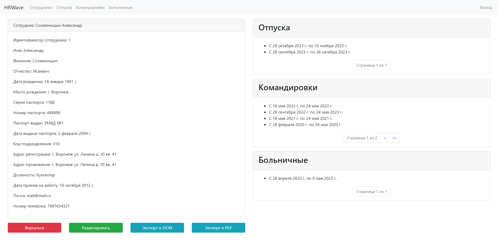
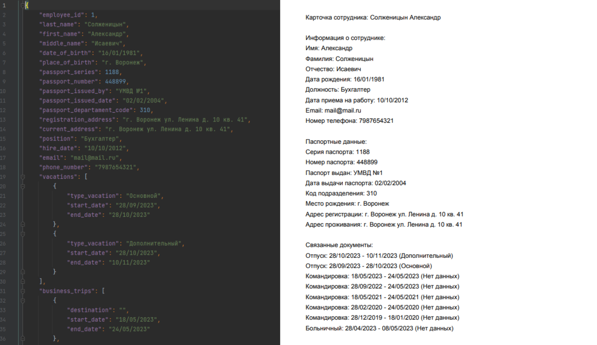
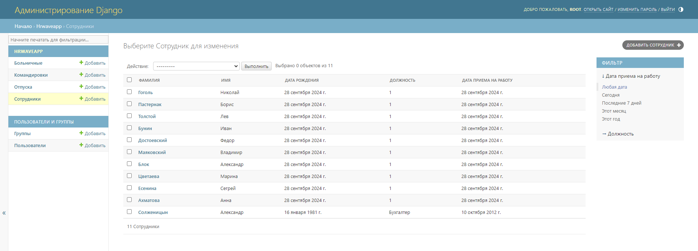

# HRWave

## Описание приложения
Веб-приложение для управления данными сотрудников и их административными событиями (отпуска, командировки, больничные)

Модели:
- Employee: Информация о сотрудниках (имя, фамилия, контактные данные и т. д.).
- Vacation, BusinessTrip, SickLeave: Данные о событиях, связанных с сотрудниками.

Представления:
- Аутентификация и выход пользователей.
- Поиск и пагинация списков сотрудников и событий.
- Создание и редактирование записей.
- Экспорт данных в JSON и PDF.

## Quick Start
1. Клонируйте репозиторий: `git clone https://github.com/xeocean/HRWave.git`
2. Создайте виртуальное окружение: `python -m venv venv`  
   - Для Linux/macOS: `source venv/bin/activate`
   - Для Windows: `venv\Scripts\activate`
3. Установите зависимости: `pip install -r requirements.txt `
4. Примените миграции: `python manage.py makemigrations` `python manage.py migrate`
5. Создайте суперпользователя: `python manage.py createsuperuser`
6. Запустите сервер: `python manage.py runserver`

